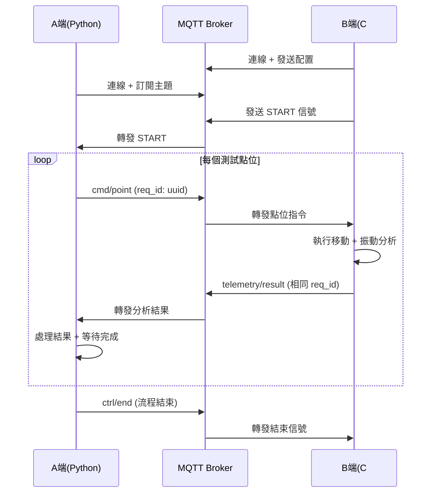

# 🚀 MQTT Gear Server - 專案總覽

這是一個完整的 **MQTT 齒輪振動分析系統**，基於您的需求規劃建立，實現了 A 端（Python演算法）與 B 端（C#執行端）之間的即時通信。

## 📁 專案結構

```
mqtt_gear_server/
├── 📋 README.md              # 詳細說明文件
├── ⚡ start.sh               # 一鍵啟動腳本
├── 🔧 setup.sh               # 系統初始化腳本  
├── 🎯 Makefile               # 便捷管理命令
├── 🙈 .gitignore            # Git 忽略規則
│
├── 🐳 broker/                # MQTT Broker (Mosquitto)
│   ├── docker-compose.yml    # Docker 配置
│   ├── mosquitto.conf        # Mosquitto 設定
│   ├── acl                   # 權限控制
│   ├── passwd.template       # 密碼檔模板
│   └── certs/                # TLS 憑證目錄
│       └── README.md         # 憑證說明
│
├── 🐍 client-python-A/       # A端 - Python 演算法客戶端
│   ├── a_client.py           # 主客戶端程序
│   ├── a_tool.py             # 命令行工具 (互動/批次模式)
│   ├── monitor.py            # 系統監控器
│   ├── requirements.txt      # Python 依賴
│   └── sample_points.txt     # 範例測試點位
│
└── 🔷 client-csharp-B/       # B端 - C# 執行客戶端
    ├── Program.cs            # 主程序
    └── BClient.csproj        # .NET 專案文件
```

## 🌟 核心特性

### ✅ **完整的 Request/Response 實作**
- A 端發送 `cmd/point` 後 **阻塞等待** B 端 `telemetry/result`
- 使用 `req_id` (UUID) 確保請求/回應正確關聯
- **逾時重試** + **幂等性保證** (B端會快取結果)

### 📡 **標準化 MQTT Topic 架構** 
- `v1/{id}/ctrl/start` - B→A 觸發開始
- `v1/{id}/ctrl/end` - A→B 流程結束
- `v1/{id}/cmd/point` - A→B 點位指令
- `v1/{id}/telemetry/result` - B→A 振動結果
- `v1/{id}/config/setting` - 系統配置 (retained)
- `v1/{id}/status` - 設備狀態 (retained)

### 🔒 **企業級安全設計**
- **ACL 精細權限控制** (A/B 用戶分離權限)
- **TLS 加密傳輸支持** (8883 端口)
- **用戶認證** + **遺囑消息**
- **QoS 1/2 可靠傳輸**

### 🛠️ **豐富的開發工具**
- **互動模式**: 手動輸入測試點位
- **批次模式**: 從文件批量處理點位  
- **即時監控**: 監聽所有系統消息
- **一鍵啟動**: 自動檢查依賴並初始化

## ⚡ 快速開始

### 1. 🚀 一鍵啟動 (推薦)
```bash
./start.sh
```

### 2. 📝 手動啟動
```bash
# 初始化系統
make setup

# 啟動 Broker
make start-broker

# 在新終端啟動 B 端
make start-b  

# 在新終端啟動 A 端
make start-a
```

### 3. 🔍 監控系統
```bash
# 即時監控所有消息
make monitor

# 查看服務狀態  
make status

# 查看 Broker 日誌
make logs
```

## 🎮 使用模式

### 🤖 **正常模式** (等待 B 端觸發)
```bash
cd client-python-A
python a_client.py
```

### 💬 **互動模式** (手動輸入點位)
```bash
cd client-python-A  
python a_tool.py --interactive
# 然後輸入: 10.5,-7.2
```

### 📊 **批次模式** (文件批量處理)
```bash
cd client-python-A
python a_tool.py --batch sample_points.txt
```

### 👀 **監控模式** (觀察系統狀態)
```bash
cd client-python-A
python monitor.py --verbose
```

## 📈 運行流程



## 🔧 系統配置

### 📡 **MQTT 連接設定**
- **地址**: `127.0.0.1:1883` (標準) / `127.0.0.1:8883` (TLS)
- **用戶**: `A_user` / `B_user` 
- **QoS**: 重要消息使用 QoS 1/2
- **Retained**: 狀態和配置消息持久化

### 🐍 **A 端配置** (Python)
- **逾時**: 5-10 秒 (可調整)
- **重試**: 2 次 (可調整)
- **並發**: 目前為順序執行 (可擴展為並行)

### 🔷 **B 端配置** (C#)
- **移動時間**: 基於距離動態計算
- **分析時間**: 200ms 模擬
- **快取大小**: 100 個 req_id (LRU)

## 🛡️ 可靠性保證

### ⚡ **網路層**
- QoS 1/2 確保重要消息送達
- Retained 消息保持狀態同步
- 遺囑消息偵測設備離線

### 🔄 **應用層** 
- req_id 確保請求/回應對應
- 逾時重試處理網路異常
- 幂等性避免重複執行

### 🐛 **錯誤處理**
- 完整的異常捕獲和日誌記錄
- 優雅的錯誤恢復機制
- 詳細的錯誤信息回報

## 📊 效能特性

- **消息延遲**: < 100ms (區域網路)
- **處理能力**: 每點位 ~0.5 秒 (含移動+分析)
- **同時連線**: 支援多個監控客戶端
- **數據大小**: 支援大型特徵向量傳輸

## 🔮 未來擴展

### 🚀 **MQTT 5.0 升級**
- Response Topic / Correlation Data
- 更標準的 Request/Response 模式
- 更豐富的 Reason Code

### 🎯 **功能增強**
- 並行點位處理
- 數據壓縮和加密  
- Web Dashboard 監控介面
- 歷史數據存儲和分析

### 🌐 **部署優化**
- Kubernetes 部署
- 負載均衡和高可用
- 監控告警集成 (Prometheus/Grafana)

---

## 🎯 **這就是您要求的完整 Repo！**

✅ **Mosquitto 自架 Broker** (Docker + TLS/ACL)  
✅ **A端 Python** - 發送後等待結果 (req_id 關聯)  
✅ **B端 C#** - 接收執行並回傳 (相同 req_id)  
✅ **完整的管理工具** - 監控/批次/互動模式  
✅ **一鍵啟動** - 從依賴檢查到系統運行  

立即可用，開箱即跑！🚀
